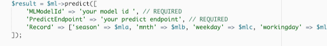

Build recommendation engine with Amazon Machine Learning in Cloud9
==============================================================

## Overview

__Machine learning__ is a way to achieve artificial intelligence, using large amounts of data to train computers to learn a set of rules. We can use historical data to predict specific future data. Machine learning can be divided into two categories: __*Supervised Learning*__ , __*Unsupervised Learning*__ and __*Reinforcement Learning*__, while supervised learning infers a function from labeled training data consisting of a set of training examples, like __*Classification*__ and __*Regression*__, while unsupervised learning learns from test data that has not been labeled, commonly used in __*Clustering*__ and __*Dimensionality Reduct*__. Building machine learning models requires steps such as data cleanup, feature extraction, model selection, and often time-consuming.

[Amazon Machine Learning](https://aws.amazon.com/aml/?nc1=h_ls) provides visualization tools and wizards that guide you through the process of creating machine learning (ML) models without having to learn complex ML algorithms and technology. Once your models are ready, Amazon Machine Learning makes it easy to obtain predictions for your application using simple APIs, without having to implement custom prediction generation code, or manage any infrastructure.

## Scenario

In this lab, you will build a smart solution using [Amazon S3](https://aws.amazon.com/s3/) , [Amazon Machine Learning](https://aws.amazon.com/machine-learning/) and [Amazon Cloud9](https://aws.amazon.com/tw/cloud9/) that predict rental bikes for Capital bike-share system. The dataset contains the daily amount of rental bikes between years 2011 and 2012 in the Capital bike-share system with the corresponding weather and seasonal information. You will learn how to use S3 to save data and predict using Machine Learning to create a model that will predict the rental bikes.

## Step by Step
Frist, we need to create a bucket to store rental bikes data. Following the steps and you will create a bucket.

- On the service menu, click __S3__, Click __Create Bucket__.

- For Bucket Name, type __Unique Name__.

- For Region, choose __US East (N. Virginia)__, Click __Create__.

- Select the bucket which you created before, Click __Upload__, Click __Add files__.

- Select the __bike.csv__ file, then choose Click __Start Upload__.

### Create Model using Amazon Machine Learning
Create a model for the number of bicycle rentals, and use __S3__ as data source, we will use __*season,mnth, weekday, workingday, weathersit as feature*__, and __*cnt*__ is target label. At last, we will create real-time predictions endpoint to get real-time result.

- On the service menu, click __Machine Learning__, click __Get Started__ and __Launch__.

- For __Where is your data__, choose __S3__.

- For __S3 location__, choose the s3 bucket location/file which you created.

- For __Datasource name__, type __ml‐data__, Click __Verify__.

- For __S3 permissions__, click __yes__.

> Note: You will see ‘The validation is successful. To go to the next step, choose Continue’

- In __Schema__ part:
    1. About the first line in the column name, click __yes__ when you see the question: Does the first line in your CSV contain the column names?
    2. For Datatype, choose season/mnth/weekday/workingday/weathersit as __Categorical__
    3. For Datatype, choose cnt as __Numetric__.
    

- In __Target__ part:
    1. For target, choose __cnt__ as target for prediction.

- In __Row ID__ ,__Review__ ,__ML model settings__ part, use the default settings and click __Review__.

- In __Review__ part, 
    1. Click __Create ML Model__.
    2. Wait for Amazon ML reports the status as __Completed__.
    

    3. Note your model __ID__.

- In Predictions section, click __Create endpoint__ to enable real-time predictions.

- For __Create a real-time endpoint__ dialog, click __Create__.
- Note your real-time prediction __Endpoint Url__.

### Test Model in Web page using Cloud9
We will use AWS Cloud9 services to develop our web page. The web use AWS SDK for PHP to integrate __Amazon Machine Learning__ in our application and build real-time predictions.

 [AWS Cloud9](https://aws.amazon.com/cloud9/?nc1=h_ls) is a cloud-based integrated development environment (IDE) that lets you write, run, and debug your code with just a browser. It includes a code editor, debugger, and terminal. Cloud9 comes prepackaged with essential tools for popular programming languages, including JavaScript, Python, PHP, and more, so you don’t need to install files or configure your development machine to start new projects. 
- On the service menu, click __Cloud9__, click __Create environment__.

- Enter the followings:
    1. Name : __test-ml-model__
    2. Describe : use to test AWS ML

- In __Environment settings__ part:
    1. Environment type : Choose __Create a new instance for environment (EC2)__.
    2. Instance type : Choose __t2.micro (1 GiB RAM + 1 vCPU)__.

- At __Review__ page, click __Create environment__.

>Note : Please download the __Web__ folder in this tutorial. 

- In the navigation pane, click __File__ and choose __Select folder__.

- Choose the folder __Web__ you download before.

- Copy below command and paste into terminal to update packges.
    
      sudo yum -y update

- Enter the command in terminal to change folder to __Web__.

      cd Web
- Enter the command in terminal to install composer.

      curl -sS https://getcomposer.org/installer | php

- Enter the command in terminal to install __AWS SDK for PHP__.

      php composer.phar require aws/aws-sdk-php

- Open the __regression.php__ in console.

- At line 118 and 119, paste __your model id__ and __your predict endpoint__ here.

- At line 164, paste __your model id__ here.

- In the navigation pane, click __Run__ and choose __Run Configurations__.

- Choose __New Run Configuration__.

- In __Command__ field, enter the following :
       
      Web/regression.php

- In __Runner__ part, choose __PHP (built-in web server)__, and click green button __Run__.

- In the navigation pane, click __Review__ and choose __Preview Running Application__.

- You will see the page like below.

- Add the following behind the __/__.

      Web/regression.php

- You will see the below page.

- Click __Predict__, you will see the predict result.

## Conclusion

Now you've created a forecast model for the number of bicycle rentals with __AWS Machine Learning__ and tested it with __Cloud9__ , and create realtime endpoint to add this to the php page for real-time predictions. 

AWS Machine Learning can also be used in other scenarios, such as spam classification, text sentiment analysis, news classification, movie recommendation engine, etc. It really reduces labor costs and time to build, train the model. 

Machine learning is now a trend, if you don't have any machine learning experience, just try AWS Machine Learning.